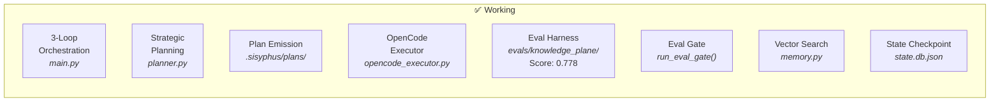
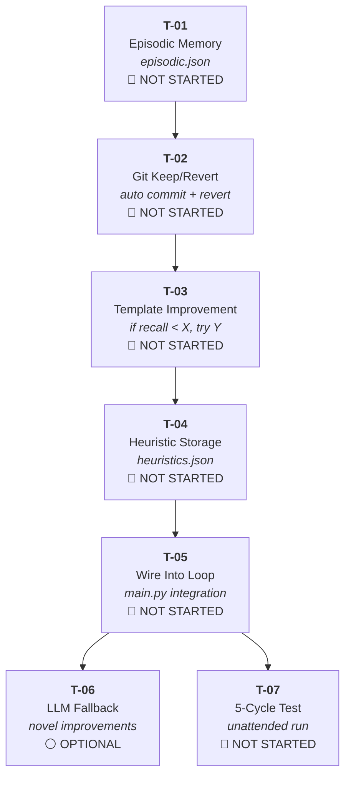
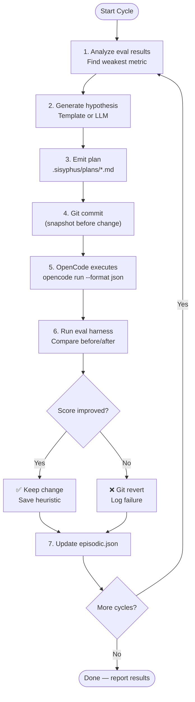
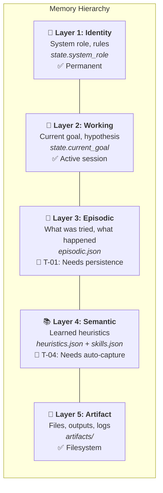

# Autonomous Self-Improvement Loop — Roadmap

> **Goal:** Replace OpenClaw with a transparent, measurable, self-improving system we fully control.
> **Oracle Decision:** 2026-03-14, O1 confidence 0.85

## Where We Are Today



## What We're Building (Oracle Task Graph)



## The Autonomous Loop (What It Will Do)



## Memory Architecture (5-Layer, O1 Design)



## Design Decisions (Oracle-Chosen)

| Decision | Choice | Why |
|----------|--------|-----|
| **Memory format** | JSON files | Git-trackable, no deps, matches existing skills.json |
| **Task generation** | Hybrid (templates + LLM) | Templates for known patterns, LLM for novel cases |
| **Keep/revert** | Git-based | Commit before change, revert on regression. Auditable. |
| **Where to build** | Extend `memory.py` | Centralize memory, reuse vector search |
| **First test** | 5 unattended cycles | Enough to see multiple keep/revert decisions |
| **Third-party deps** | None | Self-reliant. No OMO notepad/boulder dependency. |

## Score Progression

```
Baseline:       0.547  ████████████████████████████░░░░░░░░░░░░░░░░
Cycle 1 grader: 0.562  █████████████████████████████░░░░░░░░░░░░░░░
Cycle 2 cite:   0.696  ███████████████████████████████████░░░░░░░░░
Cycle 3 facts:  0.748  █████████████████████████████████████░░░░░░░
Cycle 4 dedup:  0.778  ██████████████████████████████████████░░░░░░
Oracle target:  0.600  ██████████████████████████████░░░░░░░░░░░░░░  ← exceeded
Next target:    0.850  ██████████████████████████████████████████░░
Perfect:        1.000  ██████████████████████████████████████████████
```

## Module Map (Current)

| File | Role | LOC | Status |
|------|------|-----|--------|
| `main.py` | 3-loop orchestration + OpenCode routing | ~300 | ✅ Working |
| `planner.py` | O1 strategic planning + plan emission | ~600 | ✅ Working |
| `opencode_executor.py` | OpenCode JSON event bridge | ~170 | ✅ Working |
| `worker.py` | Stateless task execution | ~65 | ✅ Working |
| `critic.py` | Worker output evaluation | ~90 | ✅ Working |
| `state.py` | 5-layer state + checkpoint | ~120 | ⚠️ Episodic resets |
| `memory.py` | Skills DB + vector search | ~250 | ⚠️ Never auto-called |
| `config.py` | Model routing + thresholds | ~100 | ✅ Working |
| `llm.py` | Unified LLM client | ~150 | ✅ Working |
| `tools.py` | Python exec, shell, file I/O | ~100 | ✅ Working |
| `evals/knowledge_plane/` | Eval harness (10 cases, 4 metrics) | ~900 | ✅ Score: 0.778 |

## Key Files Reference

| Document | What It Is |
|----------|-----------|
| `CANON.md` | Product spec authority — all decisions checked against this |
| `docs/ORIGIN.md` | Design narrative from founding conversation |
| `docs/lab/OpenCode/model-provider-strategy.md` | Provider/model/agent mapping |
| `docs/lab/OpenCode/oracle-autonomous-loop-response.json` | This roadmap's source decision |
| `docs/lab/OpenCode/o3-OpenCode.md` | Original OMO integration decision (B now, D later) |
| `ai-lab/o1_system_prompt.md` | Chief Strategist role definition |

## What "Replace OpenClaw" Means

| OpenClaw Does | Our System Does | Status |
|--------------|----------------|--------|
| Opaque orchestration | Transparent 3-loop engine | ✅ |
| Unknown model routing | Documented model/provider strategy | ✅ |
| No eval feedback | 10-case scored eval harness | ✅ |
| No memory | 5-layer hierarchy (designed) | 🔴 T-01–T-05 |
| No self-improvement | Autonomous loop (designed) | 🔴 T-01–T-07 |
| No keep/revert | Git-based discipline | 🔴 T-02 |
| Can't explain decisions | Oracle queries + responses saved | ✅ |
| Vendor lock-in | Self-reliant, any model, flat rate | ✅ |
